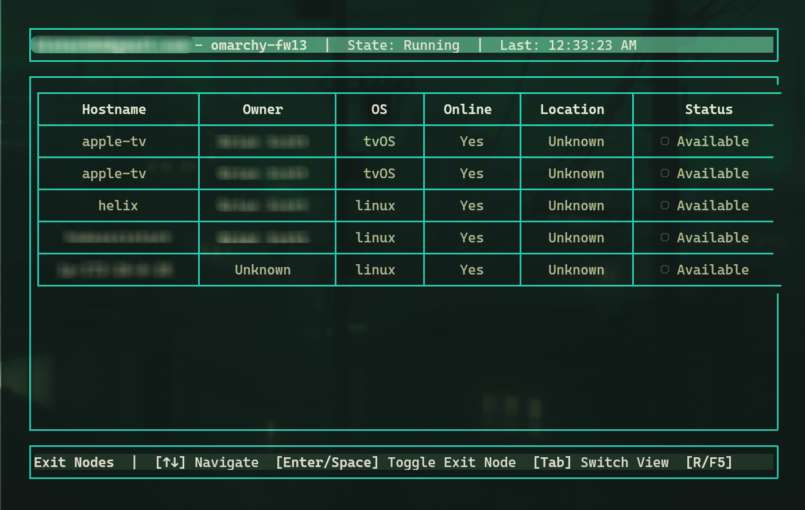

# Tailscale TUI

A Terminal User Interface (TUI) for managing Tailscale deployments on Omarchy-based hosts. This application provides a keyboard-first interface for inspecting network state and managing exit nodes.



## Prerequisites

- **Tailscale CLI**: The `tailscale` command must be pre-installed and authenticated on the host
- **Node.js**: Version 16 or higher

## Installation

### Standard Installation

1. Clone or download the project
2. Install dependencies:
   ```bash
   npm install
   ```
3. Build the application:
   ```bash
   npm run build
   ```
4. Run the application:
   ```bash
   npm start
   # or directly:
   ./dist/index.js
   ```

### Omarchy Installation

To add this TUI to your Omarchy environment:

1. **Clone and build the project** (follow standard installation above)

2. **Open Omarchy TUI Manager**:
   - Press `SUPER + ALT + SPACE`
   - Select **Install** → **TUI**

3. **Configure the TUI**:
   - **Name**: `Tailscale TUI`
   - **Command**: `node <PATH>/dist/index.js`
   - Replace `<PATH>` with the full path to your cloned repository

   Example:
   ```bash
   node /home/user/projects/ts-tui/dist/index.js
   ```

4. **Optional flags** you can add:
   ```bash
   # Mock mode for testing
   node /home/user/projects/ts-tui/dist/index.js --mock
   
   # Custom refresh interval
   node /home/user/projects/ts-tui/dist/index.js --refresh-interval=5
   ```

**Video Tutorial**: [Adding TUIs to Omarchy](https://www.youtube.com/watch?v=TcHY0AEd2Uw&t=127s)

## Usage

```bash
tailscale-tui [options]
```

### Command Line Options

- `--refresh-interval=N`: Set refresh interval in seconds (default: 3)
- `--tailscale-path=PATH`: Set path to tailscale binary (default: tailscale)
- `--help`, `-h`: Show help message

### Key Controls

### Navigation
| Key(s) | Action | Description |
|--------|---------|-------------|
| `1`, `L` | Local Node | View current device info |
| `2`, `P` | Peers | View all network peers |
| `3`, `E` | Exit Nodes | Manage exit node settings |
| `4`, `D` | Diagnostics | View logs and notifications |
| `Tab` | Next View | Cycle through views |
| `Shift+Tab` | Previous View | Cycle backwards |

### Actions
| Key(s) | Action | Description |
|--------|---------|-------------|
| `R`, `F5` | Refresh | Update data manually |
| `↑`, `↓` | Navigate | Move through table rows |
| `Enter`, `Space` | Select | Toggle exit node (in exit nodes view) |
| `H`, `?` | Help | Show keyboard shortcuts |
| `Esc` | Close | Close help/modals |
| `Q`, `Ctrl+C` | Quit | Exit application |

## Views

### 1. Local Node
Displays information about the current device including:
- Hostname and Tailscale IPs
- Operating system and backend state
- Magic DNS status
- Current exit node configuration
- Routing capabilities

### 2. Tailnet Peers
Shows a table of all peers in the tailnet with:
- Hostname and operating system
- IP addresses and online status
- Last seen timestamps

### 3. Exit Nodes
Lists available exit nodes with:
- Hostname, owner, and operating system
- Online status and geographic location
- Current active status
- Interactive selection with Enter key

### 4. Logs/Diagnostics
Displays:
- Recent notifications and status messages
- Error messages and connection issues
- Timestamped activity log

## Features

- **Real-time Updates**: Automatically refreshes every 3 seconds (configurable)
- **Offline Resilience**: Caches last known status with stale data indicators
- **Exit Node Management**: Easy selection and switching between exit nodes
- **Error Handling**: Graceful degradation with actionable error messages
- **Keyboard Navigation**: Full keyboard control without mouse dependency

## Development

```bash
# Development with hot reload
npm run dev

# Build the project
npm run build

# Run tests
npm run test

# Type checking
npm run type-check

# Lint code
npm run lint
```

## Architecture

The application is structured with:

- **CLI Client**: Abstracts Tailscale CLI interactions (`src/cli/`)
- **UI Components**: Terminal interface using Blessed (`src/components/`)
- **Data Models**: TypeScript interfaces for type safety (`src/models/`)
- **Utilities**: Helper functions (`src/utils/`)

## Error Handling

The application gracefully handles:
- Tailscale CLI timeouts and permission issues
- Malformed JSON responses
- Network connectivity problems
- Authentication failures

When issues occur, the UI remains responsive and displays actionable error messages.

## Exit Node Management

### Setting an Exit Node
1. Navigate to Exit Nodes view (`3` or `E`)
2. Use `↑` `↓` to browse available nodes
3. Press `Enter` or `Space` to select/toggle a node
4. The application automatically handles `sudo` if needed

### Status Indicators
- `● ACTIVE` - Currently selected exit node
- `○ Available` - Online and selectable
- `× Offline` - Not available for routing

## Troubleshooting

### Common Issues

| Issue | Solution |
|-------|----------|
| **"Command not found: tailscale"** | Install Tailscale CLI: `which tailscale` to check |
| **"Permission denied"** | App auto-retries with `sudo` - ensure sudo access |
| **"Connection failed"** | Check: `sudo systemctl status tailscaled` |
| **High CPU usage** | Increase refresh: `--refresh-interval=10` |
| **No data/refresh issues** | Try mock mode first: `--mock` |

### Testing Mode
Use mock mode to safely test the interface:
```bash
node dist/index.js --mock
```

### Debug Steps
1. Check Diagnostics view (`4` or `D`) for error messages
2. Verify Tailscale works: `tailscale status --json`
3. Test permissions: `sudo tailscale exit-node list`

## Development

```bash
# Install and build
npm install && npm run build

# Development mode with hot reload
npm run dev

# Safe testing with mock data
npm run dev -- --mock

# Type checking and linting
npm run type-check && npm run lint
```

## License

MIT License
